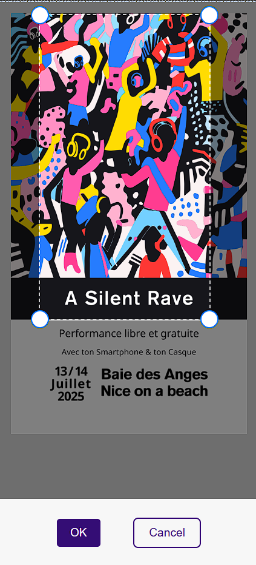
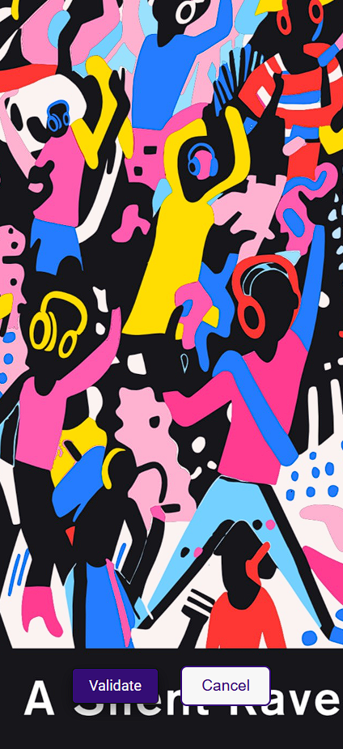

# Documentation: Dj.zic 

  

## User Interface
### Public
#### CGU

    
    

        <H3 style="margin-left: 20px; margin-top: 0;">Home</H3>
        
http://dj.zic  main page.

    

#### Invite
<H3 style="margin-left: 0px; margin-top: 0;">Inviter à nous rejoindre</H3>

Invitez qui vous voulez à se connecter au réseau wi-fi.

    
    

    

    

#### Play

    
    

        <H3 style="margin-left: 20px; margin-top: 0;">Player</H3>
        
ⓘ les barres de sons ne sont disponilbles que pour Android.

    

## Administration
### Login

    
    

    <H3 style="margin-left: 20px; margin-top: 0;">Login</H3>
    

### Stream

    
    

    <H3 style="margin-left: 20px; margin-top: 0;">Login</H3>
    

### Monitor Audience

<H3 style="margin-left: 0px; margin-top: 0;">View listeners, and audience peak.</H3>

### Modify message

<H3 style="margin-left: 0px; margin-top: 0;">Change the message displayed to listners.</H3>

    
    

### Background

<H3 style="margin-left: 0px; margin-top: 0;">Change or add a new background.</H3>

    

#### Add

<H3 style="margin-left: 0px; margin-top: 0;">Change or add a new background.</H3>

    
    
    

#### Modify

<H3 style="margin-left: 0px; margin-top: 0;">Modify/remove/set background.</H3>

    

### System

<H3 style="margin-left: 0px; margin-top: 0;">Start/restart/reboot</H3>

    
    

### Party

<H3 style="margin-left: 0px; margin-top: 0;">Plug speakers to raspberry, estimate distance for connection safety range, turn off all the devices.</H3>

    
    

