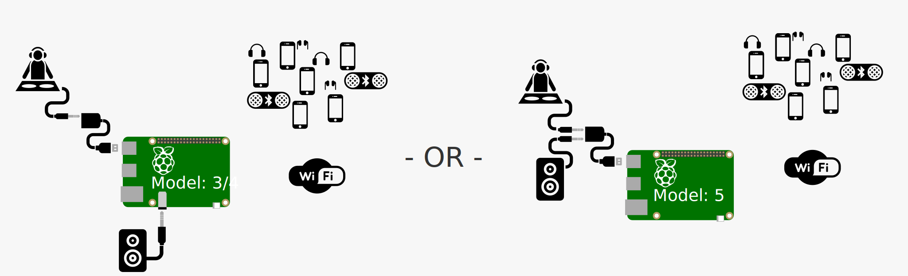
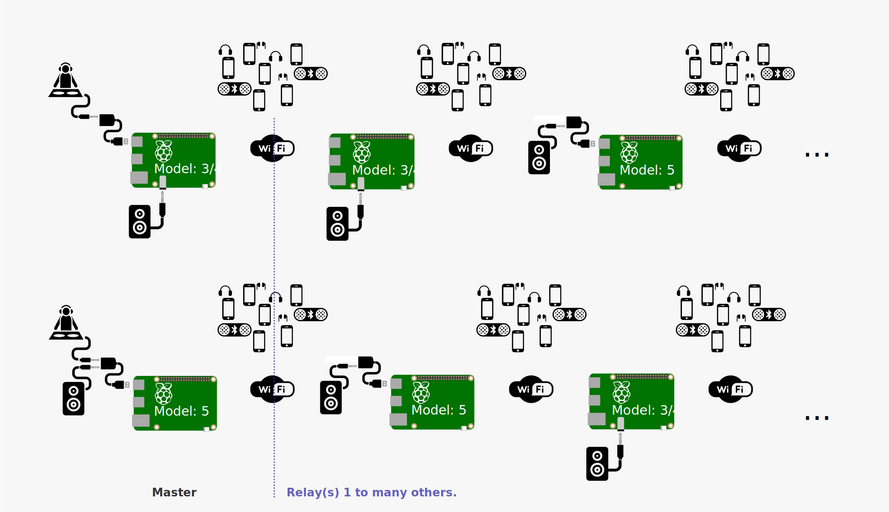
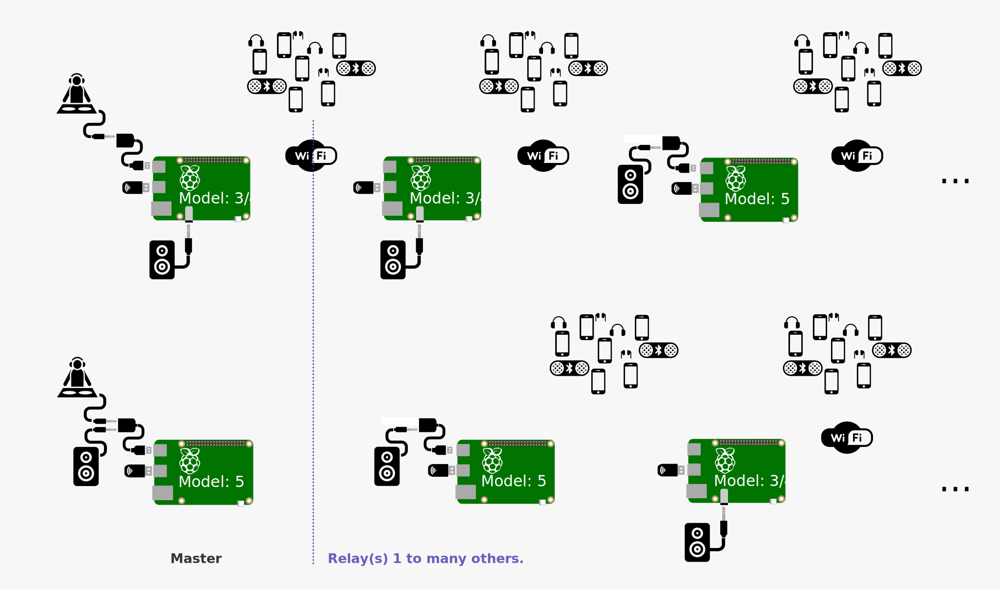

# Dj.zic  
[](README.md)

<p align="center">
  
</p>

## Qu'est-ce que c'est ?  
**DJ.Zic** est un système DIY portable de diffusion audio en direct en extérieur, basé sur un Raspberry Pi sans écran (modèles 3 à 5 - 4 Go).  
Initialement créé pour une performance festive et silencieuse de protestation. Il peut être utilisé pour des fêtes en extérieur de petite à grande taille (mode relais), ou lors de cortèges pour des manifestations silencieuses ou sonores, des performances artistiques, des événements festifs…

Il nécessite au minimum une carte son USB/jack et une alimentation. DJ.Zic diffuse l’audio via un portail Wi-Fi vers les smartphones des participants, qui peuvent utiliser leurs écouteurs ou haut-parleurs n’importe où.  
Le flux audio est également transmis via le connecteur audio du Raspberry Pi (Modèles 3 et 4), et via un adaptateur USB/jack pour le Raspberry Pi 5.

## Fonctionnalités principales  
- **Plug and play** sur tout appareil audio en jack  
- **Pas besoin d'Internet** : portail Wi-Fi captif, sans frais de données ni abonnement  
- **Infos en temps réel** sur le flux et le système  
- **Panneau d’administration M.C.** :  
  - Modifier le nom du DJ et afficher des messages  
  - Changer le fond depuis smartphone (photo directe sur Android ou galerie sur iOS)  
  - Surveiller pics d’audience et auditeurs  
  - Redémarrer services ou appareils  
  - Activer/désactiver les haut-parleurs pour basculer entre son et silence (casques)  
- **Invitations conviviales** via QR code vers l’accès Wi-Fi et l’URL dj.zic  
- **Multi-modes** :  
  - Mode solo : entre amis  
  - Mode relais : élargir la portée ou diffuser lors de cortèges/événements festifs 🚴‍♂️🔊🎶  
- **Compatible smartphones FR & EN** (écoute directe ou via Bluetooth)

## Mode Solo  
### Configuration requise  
- 1 Raspberry Pi (modèles 3, 4 ou 5)  
- 1 carte son USB/jack bon marché  
- Alimentation externe :  
  - Pi 3B/3B+ : 5V 2.5A min  
  - Pi 4 : 5V 3A min  
  - Pi 5 : 5V 5A min via USB-C Power Delivery  
- (Optionnel) Haut-parleurs

  
*Figure 1 : Architecture en mode solo (Pi 3/4/5)*

## Mode Maître + Relais  
### Avec Wi-Fi intégré  
#### Configuration requise  
- **Maître** :  
  - Raspberry Pi 4 ou 5  
  - Carte son USB/jack  
  - Alimentation  
  - (Optionnel) Haut-parleurs  
- **Relais(s)** :  
  - Raspberry Pi 3, 4 ou 5 par relais  
  - Alimentation  
  - (Optionnel) Haut-parleurs  

  
*Figure 2 : Vue système avec Raspberry maître*

### Avec Wi-Fi intégré + USB Wi-Fi  
#### Configuration requise  
- **Maître** :  
  - Raspberry Pi 4 ou 5 (le plus puissant recommandé)  
  - Carte son USB/jack  
  - Adaptateur USB Wi-Fi  
  - Alimentation  
  - (Optionnel) Haut-parleurs  
- **Relais(s)** :  
  - Raspberry Pi 3/4/5 par relais  
  - Adaptateur USB Wi-Fi par relais  
  - Alimentation  
  - (Optionnel) Haut-parleurs  

  
*Figure 3 : Vue système avec relai (géré par script d’installation)*

## Installation  
L’installation commence par le Raspberry maître, peu importe le mode.  
La détection du modèle adapte la configuration automatiquement.

### Étapes :  
1. **Créer une image Raspberry** avec [Raspberry Pi Imager](https://www.raspberrypi.com/software/)  
   - Choisir : Pi OS Lite (64-bit)  
   - **Ne pas** configurer le LAN sans fil ni la région  
   - Activer SSH avec authentification par clé (copier `id_rsa` si tu en crées une nouvelle)  
   - Préparer une image par Raspberry avec nom unique (`master`, `relay_1`, etc.)

2. **Branchement**  
   - Brancher la carte son USB/jack au maître **pendant** l’installation  
   - Installer les pilotes de l'adaptateur USB Wi-Fi **avant** l’installation (si utilisé)

3. Copier le dossier d’installation dans le dossier personnel du Raspberry  
4. Modifier identifiants admin dans `lib_install/config.py`  
5. Lancer l’installation :  
```bash
sudo python install.py
```

L’installateur demandera :  
- ```text
Souhaitez-vous utiliser d'autres Raspberry Pi comme relais ? (yes/no)
```  
  - `no` pour mode solo  
  - `yes` pour mode relais → lire la suite  

- ```text
Combien de relais souhaitez-vous utiliser ? (1–10)
```  
  Modifier cette valeur dans `lib_install/utils.py` si besoin :  
  ```python
  def selectAmountOfDevice():
      max = 10
  ```

- ```bash
Utiliserez-vous une carte Wi-Fi USB ? (yes/no)
```  
  - `no` : utilisation de la carte Wi-Fi intégrée (wlan0)  
  - `yes` : carte interne = wlan0 / carte USB = wlan1  
  ⚠️ Un adaptateur Wi-Fi USB par Raspberry est requis, avec pilotes installés.

## Mode Relais  
Une fois le maître installé, le script génère `install-Next-DjZic.tar.gz`.  
Copier ce fichier sur le relais suivant, puis :

```bash
tar -xvf install-Next-DjZic.tar.gz  
cd install  
sudo python install.py
```

Répéter pour chaque nouvel appareil, en copiant le fichier **depuis le dernier relais installé**.

## Post-installation  
Le réseau DJ.zic utilise ses propres certificats inclus dans `install-Next-DjZic.tar.gz`.  
Avec tous les appareils allumés, lancer sur tous les Raspberry simultanément (via Terminator ou MobaXterm MultiExec) :

```bash
cd ~/install  
python postinstall.py
```

Cela met à jour les `known_hosts` pour que les Raspberry communiquent entre eux.

## Vous aimez ce projet ?  
Aidez-moi à acheter du matériel pour améliorer l’architecture ou simplement montrez votre enthousiasme 😊  
Je songe aussi à adapter cet outil pour les lanceurs d’alerte : photos/vidéos/audio/streaming sans traces sur smartphone en cas d’interpellation…

[](https://paypal.me/TGrandsart?country.x=FR&locale.x=fr_FR)

## Licence  
Ce projet est sous [Licence Creative Commons BY-NC 4.0](https://creativecommons.org/licenses/by-nc/4.0/deed.fr)  
Libre à vous de partager ou adapter, **sans usage commercial** et en créditant l’auteur.

**Usage commercial et développement spécifique** : ✉️ [Contactez l’auteur](mailto:thierry.grandsart@free.fr)


## Remerciements  
Illustrations SVG issues de [Freepik](https://www.freepik.com),  
[Marz Gallery](https://www.flaticon.com/authors/marz-gallery),  
[Talha Dogar](https://www.flaticon.com/authors/talha-dogar),  
[logisstudio](https://www.flaticon.com/authors/logisstudio) via [Flaticon](https://www.flaticon.com) sous licence [CC BY 3.0](https://creativecommons.org/licenses/by/3.0/)  
Image Raspberry issue de [efa2](https://commons.wikimedia.org/wiki/File:Raspberry_Pi_B%2B_rev_1.2.svg) sous licence [CC-BY-SA-4.0](https://creativecommons.org/licenses/by-sa/4.0/)
