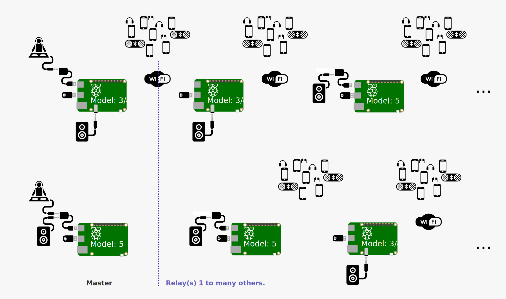

# Dj.zic
[](README-fr.md)

<p align="center">
  
</p>

## What is this?
**DJ.Zic** is a DIY portable live audio outdoor streaming system powered by headless Raspberry Pi (model 3 to 5 - 4Gb).
Originaly created for a live festive silent prostestation performance. It can be used for small to big outdoors parties (in relay mode) and also in cortege for silence/lound protestation, performance, festive events...

It requires at least a USB/jack sound card and an alimentation. Dj.zic streams audio via a wifi-portal to smartphones holders which can use their headset/speakers anywhere.
Addditionaly, the live stream is also broacasted on the Raspberry Pi audio connector (Model 3 and 4), and with an USB/Jack connector for the Raspberry Pi 5.


## Key Features
- **Plug and play** to any audio device Jack.
  
- **No Internet Required:** Uses a captive Wi-Fi portal for streaming.
  **No data packet fees** nor data subscribtion required.

- **Real-Time Stream Information:** Provides users with updates (depending on connection) about, Stream status and System infos.
  
- **M.C. Admin Panel:** The administrator can:
    - Change the **DJ Name** or display messages to the audience and can change the background picture from its smartphone.
      Android users can take the picture directly from the camera and IOS users have to take the picture first, and then select it from the picture gallery.
    - Monitor **audience peaks** and **listeners**.
    - Monitor system and restart services or device(s).
    - Mute/unmute the speakers to swich from loud event to silence with headsets.
  
- **User-Friendly Invitations:** Attendees can invite anybody to join the party via:
  a **QR code** to the access point and to the dj.zic url.

- **Multi modes**
  - Solo mode: stream with friends. 
  - Relay mode: Add relays (Raspberry Pi 3/4/5) for a wider range of audience or space or stream in cortege for silence or lound protestation, performance, festive event 🚴‍♂️🔊🎶...

- **Designed for smartphones in FR and EN** You can relay the stream from your smartphone to your bluetooth devices (headsets, speakers) or listen on the smartphone integrated speakers.

## Solo Mode
### Requirements
- 1 Raspberry Pi Model 3, 4 or 5
- 1 USB/jack Audio (inexpensive)
- External Alimentation:
  - Pi 3B/3B+: 5V 2.5A minimum
  - Pi 4: 5V 3A minimum
  - Pi 5: 5V 5A minimum (via USB-C with Power Delivery)
- Optionnal: Speakers


*Figure 1: Solo Mode Architecture for Pi3/4 or Pi5*

## Master and Relay(s) Mode
### Raspberry Pi onboard Wifi 
#### Requirements
- **Master**
  - 1 Raspberry Pi Model 4 or 5 (advised)
  - 1 USB/jack Audio (inexpensive)
  - External Alimentation:
  - Pi 3B/3B+: 5V 2.5A minimum
  - Pi 4: 5V 3A minimum
  - Pi 5: 5V 5A minimum (via USB-C with Power Delivery)
- Optionnal: Speakers
- **Relay(s)**
  -  1 Raspberry Pi Model 3, 4 or 5 per Relay
  -  1 External Alimentation per Relay
  -  Optionnal: speakers per relay


*Figure 2: System overview with a Raspberry 3/4 or 5 as a master (Order and models of the relays is for illustration only as it is managed by the install script.)*

### Raspberry Pi onboard Wifi and additional Wi-fi USB
#### Requirements
- **Master**
  - 1 Raspberry Pi Model 4 or 5 (advised to use the most powerfull device as master).
  - 1 USB/jack Audio (inexpensive)
  - 1 Wifi/USB 
  - External Alimentation:
  
    Pi 3B/3B+: 5V 2.5A minimum
  - Pi 4: 5V 3A minimum
  - Pi 5: 5V 5A minimum (via USB-C with Power Delivery)
  - Optionnal: Speakers


- **Relay(s)**
  -  1 Raspberry Pi Model 3, 4 or 5 per Relay
  -  1 Wifi/USB per Relay
  -  1 External Alimentation per Relay
  -  Optionnal: speakers per relay
  
  
  *Figure 3: System overview with a Raspberry 3/4 or 5 as a master (Order and models of the relays is for illustration only as it is managed by the install script.)*

## Installation
The installation requires to install the master Raspberry first whatever mode you'll be using.  The Raspberry model detection is part of the install which adapts the settings accordingly.

1. **Make the Raspberry image**
Make an image for your model with [raspberry Pi Imager](https://www.raspberrypi.com/software/) and:
- select: Raspberry PI OS (Other) > **Pi OS Lite (64-bit)**
- **Configure wireless LAN** and **Set locale settings** must be unchecked.
- **Enable SSH** : **Allow authorized_keys authentification only** with the key proposed by the raspberry Pi Imager or create a new one.
  
  ⚠️ In the case you already have a key and you want to create a new one, make a copy of the existing `id_rsa` otherwise it will be overwritten!

You want to use many Raspberry Pi, if so prepare one image per device with the above settings and give differents hostname for each, with master for the first device and relay_1, etc... It helps a lot to find its way.

1. **Device setup**
   
   **The USB/jack soundcard of the master Raspberry must be plugged to the Raspberry Pi.** during installation.

   **If you plan to use a WI-FI/USB adapter, its drivers must be installed before what follows.**

2. Copy the install directory of this repository on your Raspberry Pi home directory.
3. Change the default admin users and password in  `lib_install\config.py`
4. Launch the install

```bash
sudo python install.py
```

The install process will ask you:
```text
Do you plan to use other Raspberry Pi as relay(s) for this one?
(yes/no)
```
**no** for Solo mode, where no other Raspberry is needed.
No more user interection required.
Reboot the device at the end of the install 

**yes** if you have many devices to add, please read [Relay Mode](#relay-mode) and [Relay Mode Post-install](#relay-mode-post-install).
- ```text
    How many Relay, do you want yo use?
    1-10:
  ```
  You can add more devices by modifying the value of `max` **before launching** install.py in `lib_install\utils.py`

  ```python
  def selectAmountOfDevice():
        max = 10
  ```

- ```bash
  Will you use wi-fi USB card?
  (yes/no)
  ```
**no**: the Wi-Fi device is the Raspberry onboard card (wlan0).

**yes**: The raspberry onboard card is wlan0 and the USB/Wi-Fi is wlan1.
⚠️ You'll need one Wi-Fi per Rasberry, and the drivers must be installed before the installation process.

The install process will set-up the system and software.


### Relay Mode
When the install script finishes it creates a `install-Next-DjZic.tar.gz` in your home directory, move this file in the home directory of the next Raspberry and:

```bash
tar -xvf install-Next-DjZic.tar.gz
cd install
sudo python install.py
```
once installation finished an updated `install-Next-DjZic.tar.gz` will be created in your home directory. Reproduce this for each device to add.

⚠️ `install-Next-DjZic.tar.gz` must be copied from the last installed device to the new device you want to install and so on.

#### Relay Mode Post-install
The DJ.zic network uses its own certificates for security.
They are included in `install-Next-DjZic.tar.gz` if you need them to access remotely (keep it secure).

So with all devices swiched on, you can use Terminator multi-view or mobaXterm MultiExec to launch at once on all devices the following command:

```bash
cd ~/install
python postinstall.py
```
This will update the known_hosts on all the devices allowing the dj.zic system inter-connections.


## You like it?
Help me to buy new devices to make stronger architecture for large amount of devices, or to encourage me adding more functionanlities, or just express your enhusiasm for dj.zic (the musical web site which doesn't exists on the Internet 😁).

I am also thinking on rolling out this tool for whistleblowers to send pictures/videos/recordings/streaming to fellows... so that no tracks on your smartphone, when getting hit by authorities...

[](https://paypal.me/TGrandsart?country.x=FR&locale.x=fr_FR)

## Licence

This project is licensed under [Creative Commons Attribution-NonCommercial 4.0 International (CC BY-NC 4.0)](https://creativecommons.org/licenses/by-nc/4.0/deed.en).  
You are free to share and adapt this content, provided that you credit the author and do not use it for commercial purposes.

**For commercial use** and for particular dev/enhancements, please, ✉️ [contact the author](mailto:thierry.grandsart@free.fr).


## Acknowledgements
SVG Doc, made by using [Freepik](https://www.freepik.com), [Marz Gallery](https://www.flaticon.com/authors/marz-gallery), [Talha Dogar](https://www.flaticon.com/authors/talha-dogar), [logisstudio](https://www.flaticon.com/authors/logisstudio)
 from [www.flaticon.com](https://www.flaticon.com) are licensed by [CC BY 3.0](https://creativecommons.org/licenses/by/3.0/) and Raspberry pict from [efa2](https://commons.wikimedia.org/wiki/File:Raspberry_Pi_B%2B_rev_1.2.svg) licenced by [CC-BY-SA-4.0](https://creativecommons.org/licenses/by-sa/4.0/)

